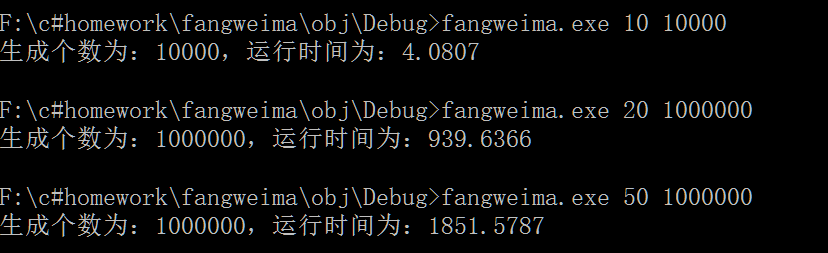

<!-- START doctoc generated TOC please keep comment here to allow auto update -->
<!-- DON'T EDIT THIS SECTION, INSTEAD RE-RUN doctoc TO UPDATE -->
**Table of Contents**  *generated with [DocToc](https://github.com/thlorenz/doctoc)*

- [防伪码生成](#%E9%98%B2%E4%BC%AA%E7%A0%81%E7%94%9F%E6%88%90)
  - [0x00 实验要求](#0x00-%E5%AE%9E%E9%AA%8C%E8%A6%81%E6%B1%82)
  - [0x01 总体思路](#0x01-%E6%80%BB%E4%BD%93%E6%80%9D%E8%B7%AF)
  - [0x02 最终代码以及效果](#0x02-%E6%9C%80%E7%BB%88%E4%BB%A3%E7%A0%81%E4%BB%A5%E5%8F%8A%E6%95%88%E6%9E%9C)
  - [0x03 参考资料](#0x03-%E5%8F%82%E8%80%83%E8%B5%84%E6%96%99)

<!-- END doctoc generated TOC please keep comment here to allow auto update -->

# 防伪码生成

## 0x00 实验要求

```
这是一个实际的项目衍生出来的核心算法之一。防伪码是我们现在经常在商品上看到的防伪手段之一，现在需要编写一个防伪码生成器，按照输入参数生成防伪码，并且把生成的时间及指定的防伪码输出。
1）防伪码的组成
防伪码由以下字符组成：0123456789ABCDEFGHJKLMNPQRSTUVWXYZ
（数字1和字母I相近、数字0和字母O相近，所以去掉字母I和字母O。全部字母大写）
2）在命令行中输入2个参数，分别是：
防伪码长度
防伪码个数
例如：在命令行中调用程序为："程序名字".exe 10 10000
指的是防伪码长度为10，生成10000个防伪码。
3）防伪码的生成及注意事项
防伪码的长度由命令行参数决定；
所生成的防伪码不能重复（按照以上例子，生成了10000个防伪码，这10000个防伪码就肯定不能重复）。
```


## 0x01 总体思路

要有计时器，随机生成防伪码，要有存储防伪码的表以及如何判断防伪码是否和先前的重复。

- 计时

```cs
using System.Diagnostics;
Stopwatch timer1 = new Stopwatch();//计时器类
timer1.Start();//开始计时
/*
其他代码
*/
timer1.Stop(); //停止计时
double dMilliseconds = timer1.Elapsed.TotalMilliseconds; 
注：
  - Elapsed.TotalMilliseconds（双）返回整个的总数，自成立以来经过的毫秒小数
    例如。秒表停在1.23456秒将在此属性返回1234.56。
```

- 生成防伪码

```cs
random出一个数，然后在"0123456789ABCDEFGHJKLMNPQRSTUVWXYZ"中取出一个。
int flag = 0;
StringBuilder securitycode = new StringBuilder();
string strTableChar = "0123456789ABCDEFGHJKLMNPQRSTUVWXYZ";
int strTableCharLength = strTableChar.Length;
Random random = new Random();
for(int j = 0;j < length; j++){
		flag = random.Next(strTableCharLength);
		securitycode.Append(strTableChar[flag]);
	}
注：
  - random.Next() --------------返回非负的一个随机数
  - random.Next(MaxValue)----------返回一个小于所指定最大值的非负随机数
  - 由于实验中的防伪码是由随机生成的一个个字符组合而成的，所以实验中出现大量将字符串拼接起来的操作，如果用String类型的话会生成新的引用，这是因为String类型的字符串是引用类型且不可改变。于是改用StringBuilder类型，此类型在处理字符串的拼接时不会生成新的引用。
```

- 防伪码的存储和唯一性

```cs
可以用哈希表来存储产生的防伪码，主要有以下2个原因：
a).哈希表是线性存储，存储时间非常快。
b).哈希表可以很快的判定要存储的元素是否已经存在。
这里的哈希表选择的是泛型集合里面的Dictionary<K,T>,其中K是字符类型即防伪码，T是一个整型值，Dictionary不允许K的值相同，当有两个相同的字符串存储进哈希表时，会出现异常，通过catch出现的异常可以跳过该值的存储，这就使得生成的防伪码都是不相同的，该算法的时间复杂度为常数，即O(1)。由于用的是泛型集合，所以这里不会出现装箱拆箱操作，所以也大大优化了速度。
Dictionary<string,int> hashTable = new Dictionary<string, int>();
try{
	hashTable.Add(securitycode.ToString(),i);
	securitycode.Clear();
	}
catch{
	i--;
	securitycode.Clear();
	}
也可以用ContainsKey方法判断
for(int i = 0; i < count; i++){
	for(int j = 0;j < length; j++){
		flag = random.Next(strTableCharLength);
		securitycode.Append(strTableChar[flag]);
	}
	if(hashTable.ContainsKey(securitycode.ToString())){
		i--;
		securitycode.Clear();
	}else{
		hashTable.Add(securitycode.ToString(),i);
		securitycode.Clear();				
	}
}
注：
  - ContainsKey: 确定 Dictionary是否包含指定的键。
  - 抛出的异常为: ArgumentNullException
```

## 0x02 最终代码以及效果

```cs
/*
 * 由SharpDevelop创建。
 * 用户： axing
 * 日期: 2017/10/29
 * 时间: 15:51
 * 
 * 要改变这种模板请点击 工具|选项|代码编写|编辑标准头文件
 */
using System;
using System.Collections.Generic; //Dictionary
using System.Linq;
using System.Text;
using System.Diagnostics; //计时
namespace fangweima
{
	class Program
	{
		public static void Main(string[] args)
		{	
			Stopwatch timer1 = new Stopwatch();//计时器类
			timer1.Start();//开始计时
			int flag = 0; //作为random出来的数字
			int icount = 0; //最后实际生成个数
			int length = Convert.ToInt32(args[0]); //作为控制台输入的第一个参数
			int count = Convert.ToInt32(args[1]);  //作为控制台输入的第二个参数
			StringBuilder securitycode = new StringBuilder();
			Dictionary<string,int> hashTable = new Dictionary<string, int>();
			string strTableChar = "0123456789ABCDEFGHJKLMNPQRSTUVWXYZ";
			int strTableCharLength = strTableChar.Length;
			Random random = new Random();
			
			for(int i = 0; i < count; i++){
				for(int j = 0;j < length; j++){
					flag = random.Next(strTableCharLength);
					securitycode.Append(strTableChar[flag]);
				}
				try{
					hashTable.Add(securitycode.ToString(),i);
					securitycode.Clear();
				}
				catch{
					i--;
					securitycode.Clear();
				}
			}
			/* 另一种判断是否重复的方法
			for(int i = 0; i < count; i++){
				for(int j = 0;j < length; j++){
					flag = random.Next(strTableCharLength);
					securitycode.Append(strTableChar[flag]);
				}
				if(hashTable.ContainsKey(securitycode.ToString())){
					i--;
					securitycode.Clear();
				}else{
					hashTable.Add(securitycode.ToString(),i);
					securitycode.Clear();				
				}
			}
			*/
			/*遍历keys
			 foreach (var key in hashTable.Keys){
        			Console.WriteLine("Output Key: {0}", key);
    			}
    			*/
			icount = hashTable.Count;
			// 生成完成 停止计时
			timer1.Stop();
			double dMilliseconds = timer1.Elapsed.TotalMilliseconds;
			Console.WriteLine("生成个数为：{0}，运行时间为：{1}", icount, dMilliseconds);
			Console.ReadKey();
		}
	}
}
注：
  - 其中 int length = Convert.ToInt32(args[0]); //Convert.ToInt32(char)将指定的 Unicode 字符的值转换为等效的 32 位有符号整数。
```



## 0x03 参考资料

[C# 控制台应用程序——防伪码](https://my.oschina.net/u/1540055/blog/280430)

[哎我用的是SharpDevelop](https://www.zhihu.com/question/29089282)