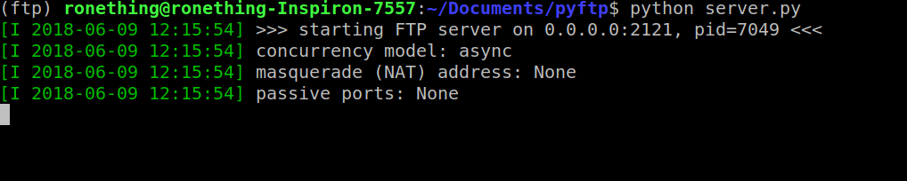
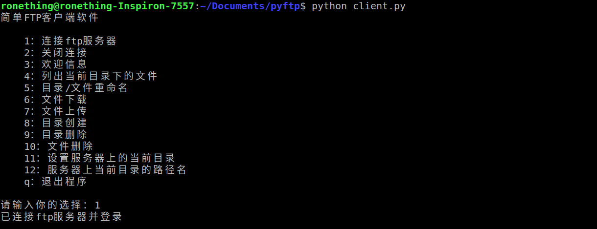

<!-- START doctoc generated TOC please keep comment here to allow auto update -->
<!-- DON'T EDIT THIS SECTION, INSTEAD RE-RUN doctoc TO UPDATE -->
**Table of Contents**  *generated with [DocToc](https://github.com/thlorenz/doctoc)*

- [计算机网络课程设计](#%E8%AE%A1%E7%AE%97%E6%9C%BA%E7%BD%91%E7%BB%9C%E8%AF%BE%E7%A8%8B%E8%AE%BE%E8%AE%A1)

<!-- END doctoc generated TOC please keep comment here to allow auto update -->

# 计算机网络课程设计

```
题目九、 简单FTP客户端软件开发（100分）
网络环境中的一项基本应用就是将文件从一台计算机中复制到另一台可能相距很远的计算机中。而文件传送协议FTP是因特网上使用得最广泛的文件传送协议。FTP使用客户服务器方式。
设计要求：
    1） 以命令行形式运行
    2） 该FTP客户端程序具有以下基本功能：能完成FTP链接的打开和关闭操作；能执行文件的上传和下载；能完成目录的创建、删除等有关操作。要求可以传输简单的文本文件。
```


python ftplib模块

1. 完成ftp链接的打开和关闭操作。
   `ftp.connect(),ftp.login(),ftp.quit()`
2. 能执行文件的上传和下载。
   `ftp.retrbinary(),ftp.storbinary()`
3. 能完成目录的创建、删除等有关操作。
   `ftp.mkd(),ftp.rmd()`
   ftp.mkd()目录存在时会抛出异常。
   附加：ftp.rmd()只能删除空目录，所以要结合一下ftp.delete()递归删除文件继而删除空目录从而达到删除非空目录的要求。
4. 要求可以传输简单的文本文件。
   要求2 已经可以实现。

---

目录结构：


安装依赖：

```
pip install -r requirements.txt
```

执行ftp服务端：

```
python server.py
```



执行ftp客户端：

```
python client.py
```




